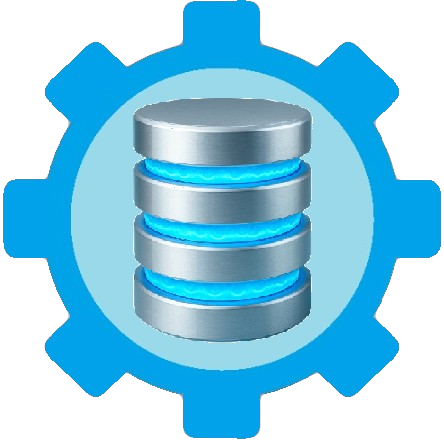
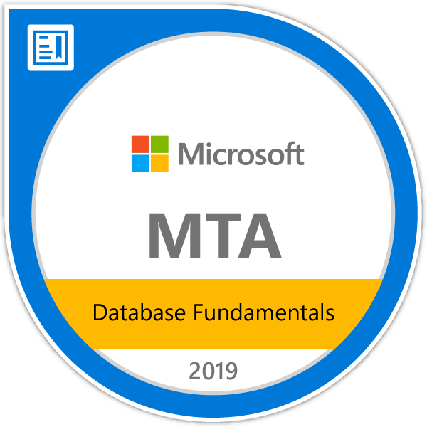
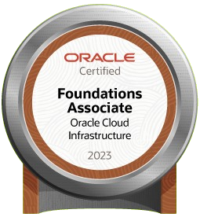

# [willdeglan.com.br](www.willdeglan.com.br) | [willdegl4n.github.io](willdegl4n.github.io)
##   SQL Dicas Database & Data Engineer ###

### Minhas certificações 
| . . . . . . . . . . . . . . . . . . | . . . . . . . . . . . . . . . . . . | . . . . . . . . . . . . . . . . . . |
|:------:|:------:|:------:|
|    [MTA 2019   Database Fundamentals](https://www.credly.com/badges/5ef823a0-aacb-457f-aaef-3c1ae4792b2a/linked_in)  |    [DP-900 Azure  Data Fundamentals](https://www.credly.com/badges/aa498172-2a97-4d77-99f3-b0fea830d8e2)  |    [PostgreSYS   Certificacao Associado ](https://api.dbadge.com.br/public/collections/8fc1135d4b9f1e31334622dc213da62f)  |
|   [Databricks   Fundamentals](https://credentials.databricks.com/9f0f80bb-274a-4368-8239-7c44c04fec7d#gs.i460r0#acc.w46Z5I8m)  |   [Databricks AI   Fundamentals](https://credentials.databricks.com/dd53e537-6f7a-4613-8c84-eb4144a22e4c#acc.Bc0FO7w4)  |   [OCI 2023  Foundations Associate   ](https://catalog-education.oracle.com/ords/certview/sharebadge?id=EC66F5BF49EEF4A9DFD8EFAAD07E3EDD068AE378B3B9429D1E4EB3DF384B0234)   |
|    [MD-101 Modern Desktop   Administrator Associate](https://www.credly.com/badges/aa498172-2a97-4d77-99f3-b0fea830d8e2)  |   [SFC Scrum 2024 Foundation Certificate]()  |    [SFC Scrum 2020  Foundation Certificate](https://www.credly.com/badges/8bd315c2-0eb3-427f-9c49-ff19f4ad6aff)  |

    
| Badge | Descrição |
|----|----|
|  |[MTA Database Fundamentals 2019](https://www.credly.com/badges/5ef823a0-aacb-457f-aaef-3c1ae4792b2a/linked_in) | 
|  |[DP-900 Azure Data Fundamentals](https://www.credly.com/badges/aa498172-2a97-4d77-99f3-b0fea830d8e2) | 
|  |[ Databricks Fundamentals](https://credentials.databricks.com/9f0f80bb-274a-4368-8239-7c44c04fec7d#gs.i460r0#acc.w46Z5I8m) | 
|  |[Databricks AI Fundamentals](https://credentials.databricks.com/dd53e537-6f7a-4613-8c84-eb4144a22e4c#acc.Bc0FO7w4) | 
|  |[MD-101 Modern Desktop Administrator Associate](https://www.credly.com/badges/aa498172-2a97-4d77-99f3-b0fea830d8e2) | 
|  |[OCI 2023 Foundations Associate](https://catalog-education.oracle.com/ords/certview/sharebadge?id=EC66F5BF49EEF4A9DFD8EFAAD07E3EDD068AE378B3B9429D1E4EB3DF384B0234) | 
|  |[SFC 2024 Scrum Foundation Certificate]() | 
|  |[SFC 2020 Scrum Foundation Certificate](https://www.credly.com/badges/8bd315c2-0eb3-427f-9c49-ff19f4ad6aff) | 
|  |[PostgreSYS Certificacao Associado](https://api.dbadge.com.br/public/collections/8fc1135d4b9f1e31334622dc213da62f) | 
|  |[SQL Dicas Database & Data Engineer](https://www.willdeglan.com.br) | 

